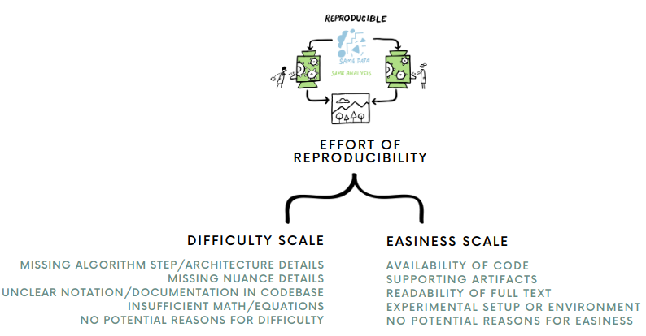

# reproeffortsignals

Code, data, and supplemental information for the work titled "Effort of Reproducibility".

### Overview

$\textit{/dəˈfīn/}$ **Reproducibility**: Reproducibility as the process of obtaining consistent computational results using the same input data, computational steps, methods, code, and conditions of analysis.

$\textit{/dəˈfīn/}$ **Effort of Reproducibility**: Qualitative assessment of the ease or difficulty in achieving consistent computational results using the same input data, computational steps, methods, code, and conditions of analysis.



### Repository structure

```shell
├── data
│   ├── effortly_alpha.csv
│   ├── dataloader.py
│   ├── __init__.py
│   └── README.md
├── environment.yml
├── LICENSE
├── media
│   └── effort_of_reproducibility.png
├── README.md
```

### Environment setup

If you want to run the statistical tests, first go into the env,

```shell
$ conda env create -f environment.yml
$ conda activate effortly
```

once the conda env is setup, run

```shell
TBA
```

### Experiments
TBA

### Results

More information on this can be found from `results/` directory.